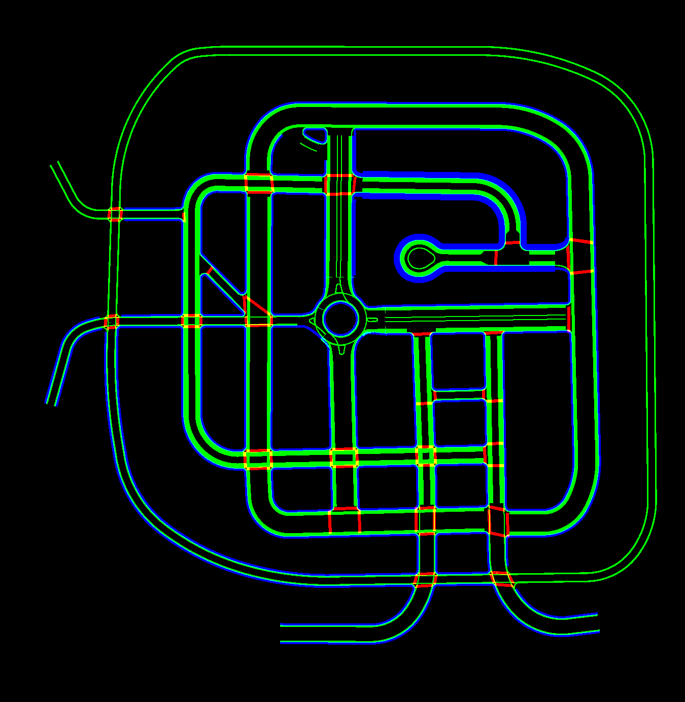

# CARLA_maps:

Render all Carla maps as layered occupancy grids, where each layer contains only the types of elements specified.  For instance, a driving layer might only record the locations of drivable surfaces.


## Example from Town03
Pedestrian friendly regions with *Sidewalks* marked in BLUE, *Crosswalks* in RED and *Road Shoulders* marked in GREEN.


A simple python based xml parser to render maps from the Carla simulator as occupancy grids for planning/training. A sample grouping and the resulting render for Town03 can be found in the [local docs folder](docs/).

### Usage:
```
% xml_map_parser <args>
```

While the output is complete, and works well for most elements, formats and designs are still subject to change.  Feel free to use it as-is, or make changes, pull-requests are welcome.


